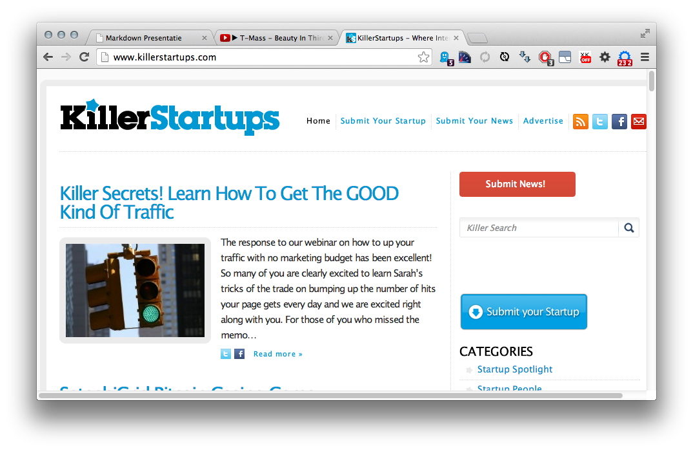
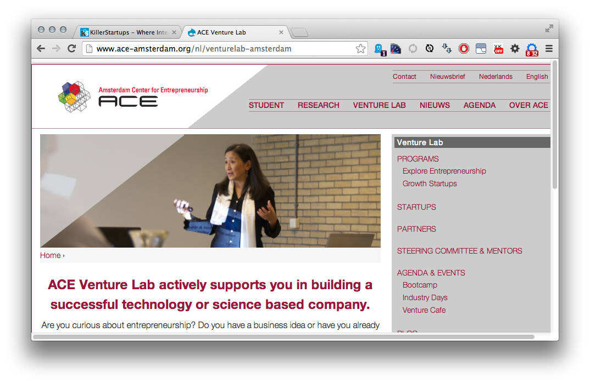
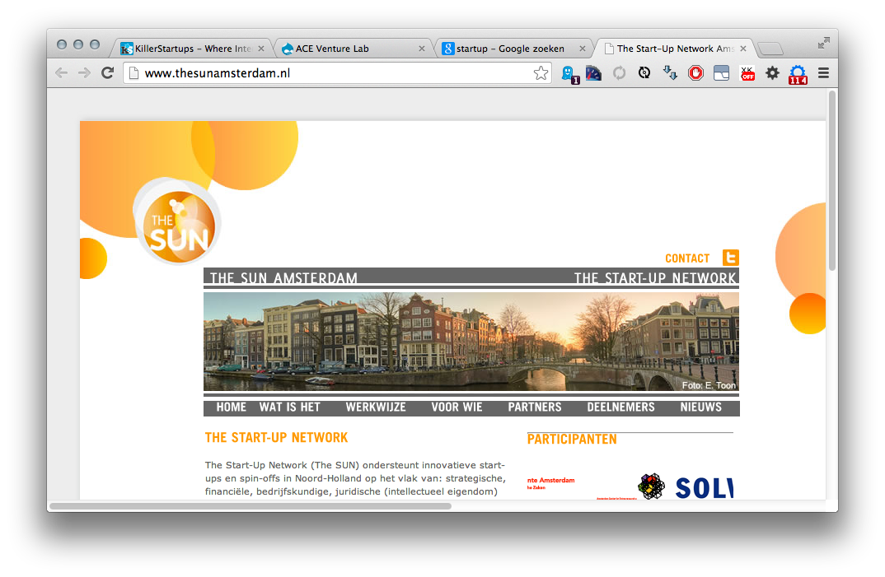
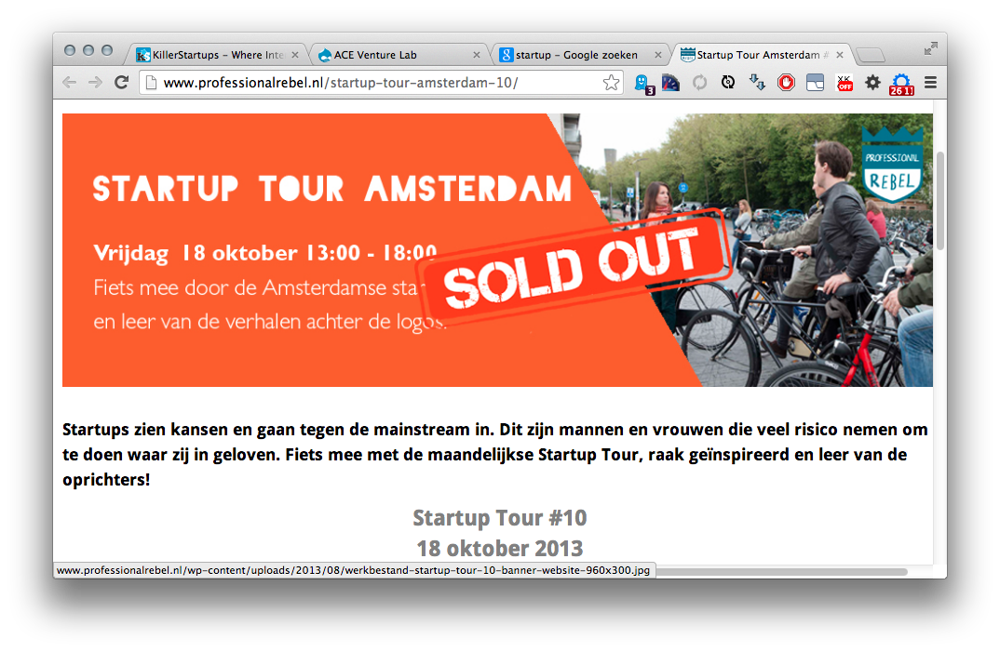
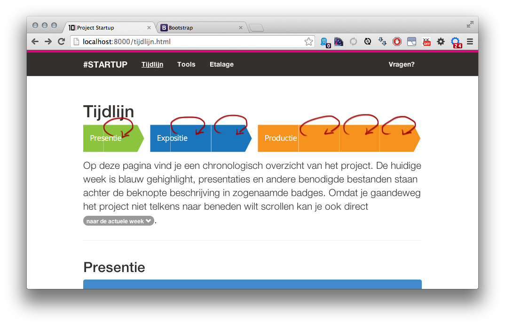
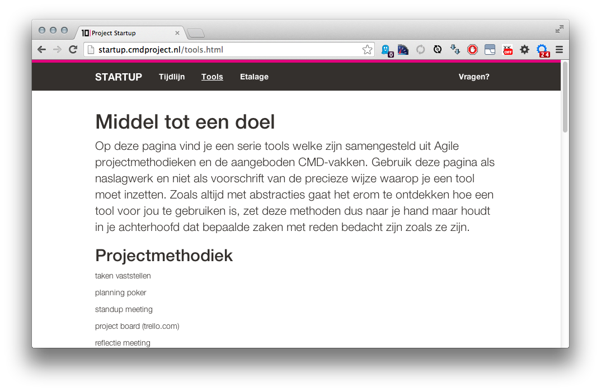
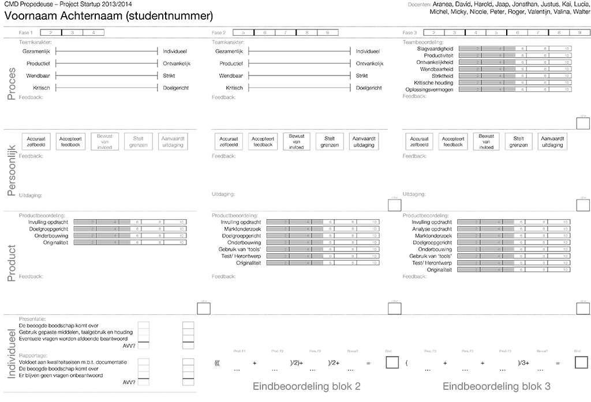
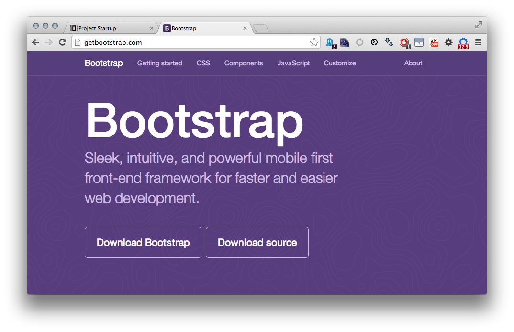

# Project Startup

!

> A startup company or startup is a company, a partnership or temporary organization designed to search for a repeatable and scalable business model. These companies, generally newly created, are in a phase of development and research for markets. The term became popular internationally during the dot-com bubble when a great number of dot-com companies were founded. - http://en.wikipedia.org/wiki/Startup_company

!

!

!

!

!

# 16 CMD Startups

!

# Coaches

- zwart - Lucia
- grijs - Justus
- wit - Valentijn
- ivoor - Nicole
- geel - Peter
- oker - Jonathan
- oranje - Kai
- rood - Roger
- groen - Valina
- turquoise - David
- blauw - Harold
- cyaan - Aranea
- paars - Micky
- lila - Walter
- roze - Jaap
- magenta - Michel

!

# Beauty in thirds

1. Single page website (3 weken)
2. Viral videoclip (5 weken)
3. Opdracht binnenslepen (8 weken)

!

!

# Agile?

Wij laten zien dat er betere manieren zijn om software te ontwikkelen 
door in de praktijk aan te tonen dat dit werkt 
en door anderen ermee te helpen. Daarom verkiezen we

**Mensen en hun onderlinge interactie** boven processen and tools

**Werkende software** boven allesomvattende documentatie

**Samenwerking met de klant** boven contractonderhandelingen

**Inspelen op verandering** boven het volgen van een plan

Hoewel wij waardering hebben voor al hetgeen aan de rechterkant staat vermeld,
hechten wij méér waarde aan wat aan de linkerzijde wordt genoemd. [agilemanifesto.org](http://agilemanifesto.org)

!

# Tools

!

# Beoordeling

!

# Fase 1

!

[bootstrap?](http://getbootstrap.com)

!

# @josk