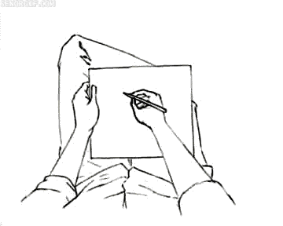

# Project Startup
## WG1: welke onderneming?

!

# Agenda

- Normen en waarden
- Identiteit van de onderneming
- Grip op Agile
- Teamindeling

!

# Normen en waarden

Welk gedrag ervaar je als vervelend in projectwerk? [(Opzet afspraken)](afspraken.docx)

!

# De identiteit van jouw onderneming

Hoe presenteren jullie je?

!

# Grip op Agile
Vandaag bespreken we kort de doelen van twee Agile technieken waar we de komende weken mee gaan experimenteren.

- Standup meeting
- Planning Poker
- Reflection meeting

!

# Standup meeting
Een standup meeting is een korte werkbespreking waarin je puur op taken aan het team meedeelt hoe de stand van zaken is.

Je stelt grofweg drie vragen en gaat systematisch alle teamleden af, de vragen zijn:

1. Wat heb je tot nu toe gedaan
2. Welke problemen kwam je tegen (en kan iemand daar bij helpen)
3. Wat ga je de komende periode doen

--

Do's: [How to Hold a Daily Standup Meeting](http://youtu.be/YBKuYzqvZmI) (youtube)

Don'ts: [Agile Simulation - Part 20 | The Daily Standup](http://youtu.be/q_R9wQY4G5I) (youtube)

!

# Planning poker
Het 'pokerspel' is een speelse manier om zaken die in projecten moeilijk zijn makkelijk te maken:

- Inschatten van benodigde tijd voor taken
- Met het team overleggen wat een taak inhoudt
- Delen van kennis
- Alle neuzen dezelfde kant op

--

Do's: [Agile in Practice: Planning Poker](http://youtu.be/0FbnCWWg_NY)

Don'ts: je niet professioneel gedragen

!

# Reflectie meeting
Tijdens de reflectie meeting (elke 2 weken) kijken we terug op de laatste iteratie en kijken we welke dingen goed gingen en welke dingen beter kunnen. Daar gebruiken we telkens andere didactische methoden (onderwijstrucjes) voor. Grofweg komt het weer neer op drie vragen:

- Wat ging er goed
- Wat kan er beter
- Hoe gaan we daar voor zorgen

Let op: deze vragen worden zowel op teamniveau als op persoonlijk niveau gesteld!

!

# Teamindeling
Voor straks: volg met je team de handleiding (PDF) op startup.cmdproject.nl om jullie Trello board in te richten. 

Als je dat gedaan hebt kan je al vast beginnen met de eerste taken in Trello, de verschillende facetten van het onderzoek!

