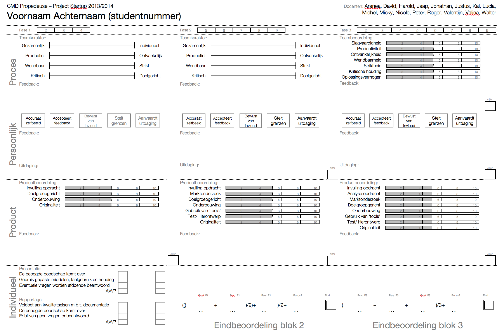
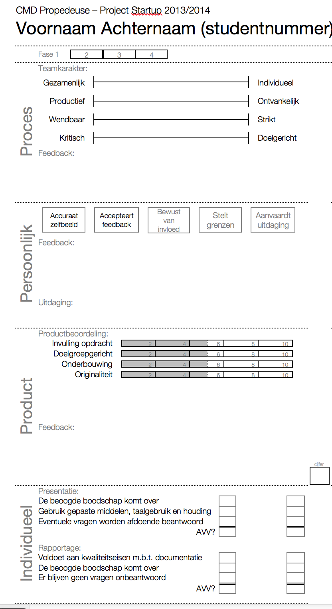
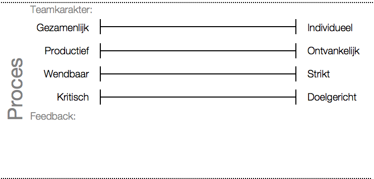
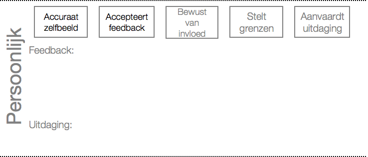
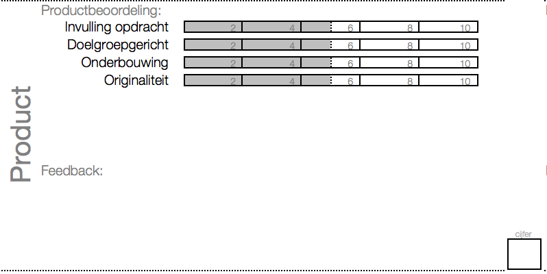
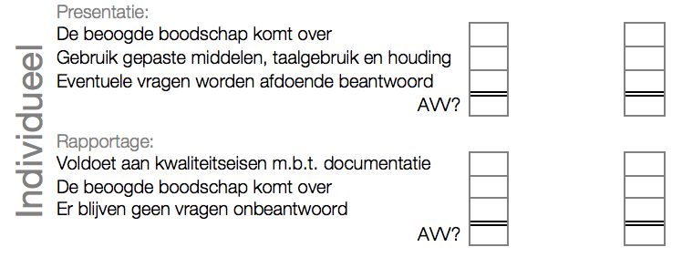
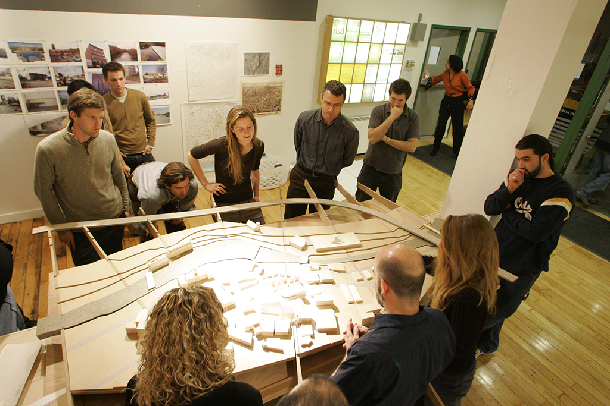

# Werkgroep 2
> Gebruik de pijltjes naar links en rechts om door de dia's heen te lopen ^^// - Justus

!

# Presentaties!
Informele presentatie van bestudeerde onderwerpen door alle betrokken studenten. Maximaal 10 minuten per presentatie!

- bitcoin
- crowdfunding
- mobile payments

!

# On being Agile

!

# Beoordelingsformulier

Het beoordelingsformulier is grofweg opgedeeld in drie kolommen. 

!

# Beoordeling

In deze eerste fase is de meest rechter kolom van belang.

!

# Beoordeling Proces

Op de achterkant van het formulier staat beschreven wat met de verschillende termen bedoeld wordt. Lees dit gezamenlijk door en maak onduidelijkheden bespreekbaar. Let op, deze fase is het proces een formatieve beoordeling, je krijgt dus geen cijfer.

!

# Beoordeling Persoonlijk

Op de achterkant van het formulier staat beschreven wat met de verschillende termen bedoeld wordt. Lees dit gezamenlijk door en maak onduidelijkheden bespreekbaar. Let op, deze fase is de persoonlijke beoordeling eveneens formatief, je krijgt ook hier nog geen cijfer.

!
# Beoordeling Product

Op de achterkant van het formulier staat beschreven wat met de verschillende termen bedoeld wordt. Lees dit gezamenlijk door en maak onduidelijkheden bespreekbaar. Het product wordt wel summatief beoordeeld, daar ontvang je dus per team een cijfer voor.

!

# Beoordeling Individueel

Op de achterkant van het formulier staat beschreven wat met de verschillende termen bedoeld wordt. Lees dit gezamenlijk door en maak onduidelijkheden bespreekbaar. De individuele beoordeling is gedurende het hele project inwisselbaar op officiële presentatiemomenten (7x). Elke student *moet* beide onderdelen AVV afgerond hebben anders ontvangt deze in blok 3 geen cijfer.

!

# Beoordeling
De hele tekst op de achterzijde van het formulier is ook te lezen op de studiegids pagina van het project op intranet.

!

# De doelgroep

Afbeelding van deathtostockphoto.com

!

# De doelgroep

Afbeelding van www.risd.edu

!

# De doelgroep

Afbeelding van everestuncensored.org

!

# De doelgroep

Afbeelding van www.libertaris.me

!

# De doelgroep

Afbeelding van deathtostockphoto.com

!

# De doelgroep
Neem met je team de doelgroepsomschrijving op de website door en bespreek klassikaal punten die je opvallen. IOW, praat er met andere teams over.

!

# Let's get started // An die Arbeit // Aan de slag // давайте начнем
Neem de taken over die op startup.cmdproject.nl staan en vang aan... ik spreek jullie straks bij de werkplaats voor een standup meeting.