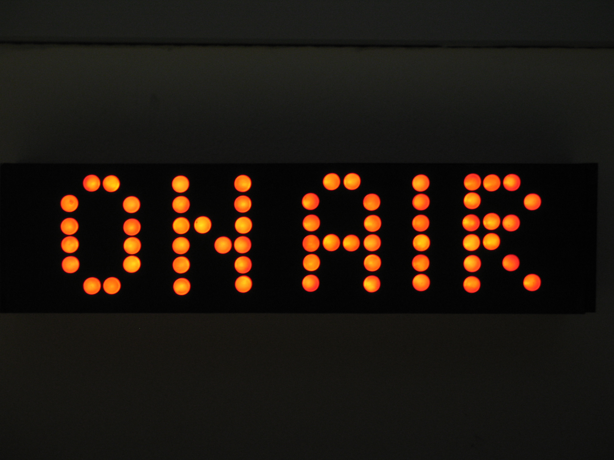

# Beoordeling en feedback
*nog 5 minuten dan...*

!

# Agenda
- presentaties en productbeoordeling
- teamfeedback
- nieuwe teamindeling
- nieuwe taken

**tijdens de werkplaats**

- procesbespreking per team

!

# Presentaties

!

# Persoonlijke feedback
*beschrijvend*: Door de eigen reactie te beschrijven laat je de ander vrij om deze informatie naar eigen goeddunken te gebruiken, laat waardeoordelen achterwege.

*specifiek*: Tegen iemand zeggen dat hij dominant is helpt minder dan zeggen: 'Juist toen we op het punt stonden een besluit te nemen luisterde je niet naar de anderen maar walste je over de mening van anderen heen.'

*bruikbaar*: Goede feedback is gericht op gedrag waar de ontvanger iets aan kan veranderen, laat tekortkomingen waar iemand geen invloed op kan uitoefenen achterwege.

*goed geformuleerd*, feedback is beter bruikbaar wanneer het concreet en helder is.

*correct*, in het team kan geverifieerd worden of de feedback klopt.

!

# Feedback ronde 1 (groen)

1. probeer ieder terug te geven wat je als een sterk punt van hem/haar ziet, waarom je blij bent dat de persoon in jouw team zit, 
2. schrijf je bericht in de ik vorm, 
3. probeer specifiek te zijn, 
4. probeer persoonlijk te zijn, d.w.z. schrijf een bericht wat niet voor iedereen zou kunnen gelden (geen horoscoop), 
5. schrijf voor iedereen iets op, ook al ken je ze niet allemaal even goed en vi) vergeet niet je eigen naam te noteren.

!

# Feedback ronde 2 (rood)

1. probeer ieder aan te geven wat je als een zwak punt van hem/haar ziet, op welke wijze de persoon een nog grotere meerwaarde voor het team zou kunnen betekenen, 
2. schrijf je bericht in de ik vorm, 
3. probeer specifiek te zijn, iv) probeer persoonlijk te zijn, 
4. schrijf voor iedereen iets op 
5. vergeet niet je eigen naam te noteren.

!

# Feedback samenvatten (geel)
Vat de door jou ontvangen feedback samen op een gele post-it, plak alle post-it's (groen/rood/geel) op jouw beoordelingsformulier, vouw het dicht en geef het terug aan de docent.

!

# Teamindeling Fase 2
Een nieuwe fase, een nieuw team, wissel tijdens de les nog gegevens uit, maak een Facebook/ Whatsapp/ Google+/ Whatever groep zodat jullie elkaar kunnen bereiken.

!

# Nieuwe taken!
De indeling van het Trello board wordt uitgebreid met 2 kolommen:

- Tasks: voor alle taken die nog te doen zijn en al gedaan kunnen worden.
- Work in progress: voor alle taken die toebedeeld zijn aan een of meerdere teamleden en waar daadwerkelijk aan gewerkt wordt.
- Ready for testing: voor taken die klaar zijn om getest te worden.
- Testing: voor taken die toebedeeld zijn aan een of meerdere teamleden en die daadwerkelijk getest worden. 
- Done: voor alle taken die afgerond zijn.
- Blocked: voor taken die nog niet uitgevoerd kunnen worden omdat deze geblokkeerd worden door andere nog uit te voeren taken.
- Delayed: voor taken die in deze iteratie nog niet behandeld zullen worden.

!

# Werkplaats
Ga in je oude groep zitten in de werkplaats. Ik kom langs om de teams te bespreken.
