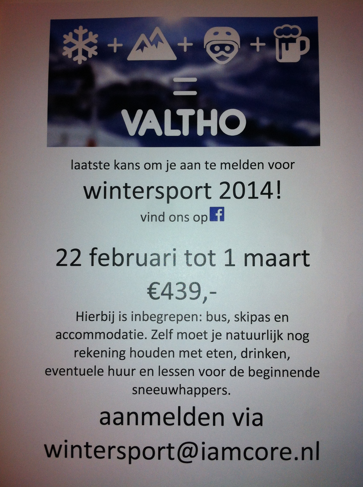

# Rapporteren
de rapportage zelfst.naamw. (v.)
Uitspraak:  	[rɑpɔr'taʒə]
Verbuigingen:  	rapportage|s (meerv.)

1) verslag van iets dat is onderzocht of beoordeeld
> De minister wacht de rapportage van de commissie af voordat ze actie onderneemt.

2) het maken van een rapport

> Die rapportages kosten de politie erg veel tijd.

http://www.woorden.org/woord/rapportage

!

!

!

# Rapporteren?

- **Macro**: Opzet
- **Meso**: Indeling
- **Micro**: Invulling

!

# Opzet

!

# Indeling

!

# Invulling

!

## Standaard onderdelen

- Inleiding
- Gestructureerde inhoud
- Conclusie
- Omslag
- Inhoudsopgave
- Bronvermelding
- Bijlagen

!

## Volgorde van behandelen

- structuur van de inhoud
- inleiding
- inhoud
- bronvermelding
- conclusie
- omslag
- inhoudsopgave
- bronnenlijst
- bijlagen

!

### Structuur van de inhoud (=logische opbouw)
In jullie geval is er al een onderverdeling in taken, dat is een voordeel omdat je geen documentonderdelen meer hoeft te verzinnen!

**Stap 1:** Vaststellen tekstschema

soort, onderdeel, aspect, betrokken partijen, oorzaak, oplossing, plaats, tijd, onderzoeksfase, etc.

!

### Structuur van de inhoud (=logische opbouw)
In jullie geval is er al een onderverdeling in taken, dat is een voordeel omdat je geen documentonderdelen meer hoeft te verzinnen!

**Stap 2:** Maken _waaierschema_

- opzet onderzoek
	- beschrijving
	- probleemstelling
	- deelvragen
	- opgegeven doelgroep
- resultaten onderzoek
	- deelvraag 1
	- deelvraag 2
	- deelvraag 3
	- etc.
- oplossingsrichtingen
	- oplossing 1
	- oplossing 2
	- oplossing 3
	- etc.
- verbinding resultaten met gekozen oplossingsrichting (onderbouwing)
	- weerlegging oplossing 3
	- weerlegging oplossing 1
	- onderbouwing oplossing 2
- overzicht van de gekozen oplossing
	- flowcharts
	- (wireframes?)
	- (storyboards?)
	- (moodboards?)
	- screenshots met uitleg
	- stijlgids (style tile)

!

### Structuur van de inhoud (=logische opbouw)
In jullie geval is er al een onderverdeling in taken, dat is een voordeel omdat je geen documentonderdelen meer hoeft te verzinnen!

**Stap 3:** Maken hoofdstukkenindeling

Hoofstuk- en paragraaftitels zijn:

- informatief en dekkend
- kort en kernachtig
- eenduidig geformuleerd

!

### Inleiding
Een inleiding is geen voorwoord!

**Aanleiding** grijp de aandacht door een actueel nieuwsfeit of voor jouw rapportage belangrijk punt te noemen. Beschrijf vervolgens beknopt de aanleiding voor jouw rapportage. (bijv. benaderd door stichting X)

**Indeling** Behandel in grote lijnen het tekstschema (aan de hand van de hoofdstukkenindeling)

!

### Inhoud
Neem noooooooit letterlijk een bron over maar beschrijf de voor jouw onderzoek belangrijke punten in eigen woorden. Verwijs altijd netjes anders pleeg je plagiaat!

!

### Bronvermelden
MLA? APA? Chicago? Gebruik één standaard en hanteer die overal, in al je rapportages gedurende de rest van de opleiding.

Stijlen:
- inline
- in voetnoten
- in eindnoten

!

### Conclusie
In deze presentatie heb ik jullie laten zien hoe je systematisch  de kaders voor een rapportage opstelt. Achtereenvolgens zijn de structuur van de inhoud, inleiding, inhoud, bronvermelding en conclusie aan bod gekomen. Ik hoop dat jullie hiermee meer grip krijgen op het schrijven van rapportages voor het project. Wellicht dat deze presentatie in een kennisclip (online tutorial video) verwerkt gaat worden, daarover later meer.

In een conclusie vind je:

- korte onderbouwing en belangrijkste bevindingen (product)
- een reflectie op het proces en eventuele aanbevelingen
- (aankeiler voor vervolgonderzoek?)

!

# Na de inhoud?

**omslag** een afbeelding is niet nodig maar mag wel. In ieder geval een titel en auteursgegevens.

**inhoudsopgave** kan je genereren uit de semantische waarden van Word. Neem nooit de inhoudsopgave op in de inhoudsopgave want dan breekt je document ^^//

**bronnenlijst** kan je met Word genereren maar er zijn natuurlijk ook goede browserplugins.

**bijlagen** alle ruwe onderzoeksinformatie maar geen volledige bronnen!

!

# Vragen? Tips?
- Kies maximaal één indelingscriterium voor je tekstschema.
- Heeft elk hoofdstuk een aparte inleiding of is er één inleidende alinea voor het hele document, of beide?
- Behandel in een alinea precies een onderwerp
- Gebruik koppelalinea's om hoofdstukken netjes in elkaar te laten overlopen
- Verwijs altijd naar bronnen anders pleeg je plagiaat (schorsing)