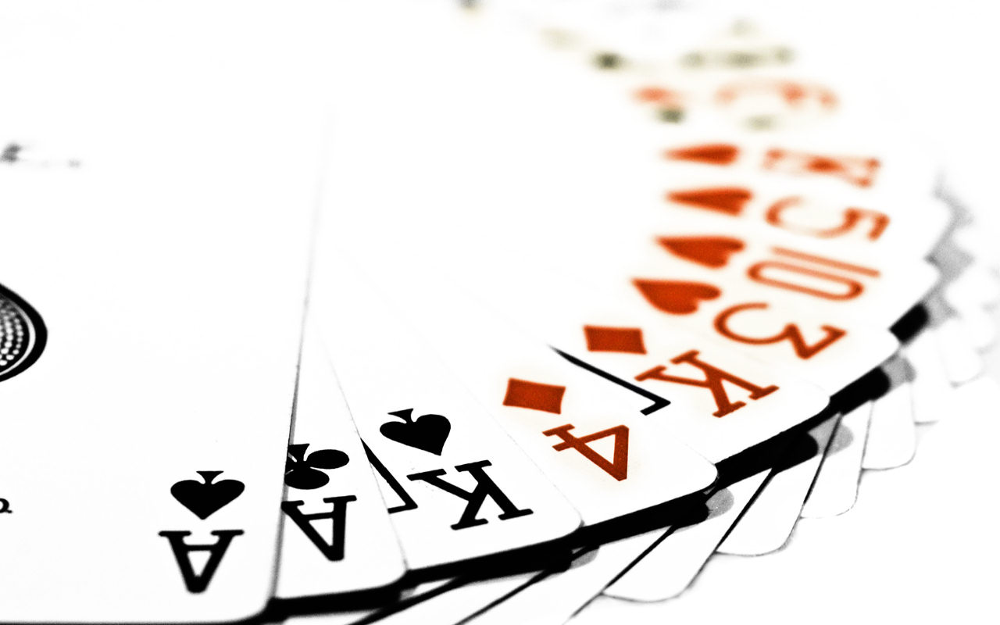

# Fase 2 FTW!

!

# Agenda
- (Kennisdeling)
- (Individuele uitdaging)
- Inventarisatie specialiteiten
- Brainstorm op procesniveau
- Planning Poker!

!

# Kennisdeling \*optioneel\*
We presenteren kort en bondig in drie ronden de onderzochte onderwerpen. Let op, per onderdeel hebben we niet meer dan 5 minuten!

- Viral- en Guerilla Marketing
- Viral video's en Internet Meme's
- Storytelling

!

# Individuele uitdaging
Het is de bedoeling dat jullie een realistische uitdaging opstellen waar je eind van dit blok op op beoordeeld kunt worden. Ga na of jouw uitdaging antwoord geeft op de volgende vragen:

- Wat wil je veranderen of waar wil je aandacht aan besteden?
- Hoe ga je dat doen?
- Hoe kan ik controleren of je dat ook daadwerkelijk gedaan hebt, wat voor bewijslast ga jij aandragen?

!

# Individuele uitdaging
Een veelgebruikte methode voor het opstellen van doelstellingen (een uitdaging is een soort doelstelling) is de SMART methode. Je zorgt er voor dat jouw uitdaging in één net geformuleerde volzin aan de volgende punten beantwoord. Jouw uitdaging is:

- Specifiek
- Meetbaar
- Ambitieus (omdat het om een uitdaging gaat!)
- Realistisch
- Tijdsgebonden

[http://en.wikipedia.org/wiki/SMART_criteria](http://en.wikipedia.org/wiki/SMART_criteria)

!

# Inventarisatie specialiteiten
Inventariseer de specialiteiten in jouw team denk aan dingen als: 

programmeren, illustratie, fotografie, animatie, schetsen, schilderen, creatief met kurk, audio, video, leiderschap, onderzoek, knopen doorhakken, documenteren, presenteren, argumenteren, motiveren, filmen, montage, acteren, make-up, filosoferen, zingen, dansen, locaties spotten, skateboarden, paardrijden etc..

Noem alles wat je kunt!

!

# Brainstorm op procesniveau

!

# Wat is procesniveau?
Doel van de brainstorm is een opsomming van taken die gedurende de komende weken uitgevoerd gaan worden.

Hints:

- 'Bedenken wat we gaan doen' is onderdeel van de takenlijst en een inhoudelijke brainstorm is wellicht een manier om hier antwoord op te geven (denk aan NPD en UCD!)
- 'Wat voor mogelijkheden zijn er' is onderdeel van de takenlijst en een grondig onderzoek waard.
- 'Wat wil de doelgroep' is een vraag die je MOET stellen als team, hoe ga je daar antwoord op vinden? Welke stappen moeten jullie daarvoor nemen? Elke stap is een taak.
- Tenslotte, denk aan alle vakken en projecten die je de afgelopen twee blokken hebt gehad, zet de daar opgedane kennis in. Kijk hierbij ook naar de taken uit de vorige fase (het oude Trello board), wellicht komen er een aantal overeen?

!

# Straks tijdens de werkplaats!
Als jullie straks klaar zijn met pokeren, richt dan je Trello board in aan de hand van de nieuwe taken.

De laatste 50 minuten van de werkplaats wil ik graag standup meetings houden! Zorg er voor dat je daar klaar voor bent.

!

# Planning Poker!

[Filmpje over de planning poker](http://youtu.be/0FbnCWWg_NY)