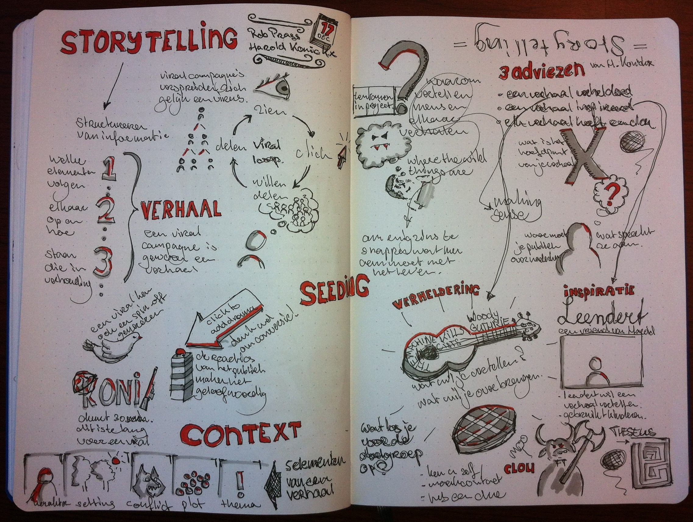

# Story? Telling?

!

# Vandaag

- Eisen aan het MVP
- Black Stories
- Story Cubes
- Jouw viral campagne

!

# Eisen aan het MVP
Stel met je team eisen op waar jouw MVP op donderdag 9 januari aan moet voldoen, houd in je achterhoofd:

- Je MVP moet testbaar zijn
- Je MVP moet presenteerbaar zijn.

!

# Black Stories
Als opwarmertje gaan we black stories spelen, de spelregels zijn als volgt:

- Kies per team een raadselmeester, de rest is automagisch raadselvolk.
- Het raadselvolk mag vragen stellen welke te beantwoorden zijn met ja of nee.
- De raadselmeester mag hints geven als het raadselvolk volledig vast zit, maar maak het niet te makkelijk
- De raadselmeester krijgt een black story, lees de voorkant voor maar laat de achterkant niet aan het team zien (daar staat de oplossing)

!

# Story Cubes
Nu we opgewarmd zijn spelen we een ingewikkelder spel, het gaat er puur om mooie verhalen te verzinnen.

- Houdt een camera in de aanslag!
- De coach komt langs met de dobbelstenen, elk teamlid gooit 3 dobbelstenen, deze beschrijven jouw superkracht. (wees inventief!)
- Opnieuw gooit elk teamlid, maar nu met 9 dobbelstenen, deze beschrijven de historie van jouw character.
- Tenslotte gooit het team nog een maal, met 9 dobbelstenen. Aan de hand van deze worp beschrijft het team gezamenlijk de aartsvijand.
- Verzin een verhaal met de personage's die je zojuist hebt gekregen.

Presentatie: Ongeveer 30 minuten later dragen jullie het verhaal voor aan de rest van de klas.

!

# Jouw viral campagne

Sketchnote van het college van Justus

!

# Straks in de werkplaats
Verzin het verhaal voor jullie viral (voor zover je daar nog niet mee begonnen was).

Standup meetings!