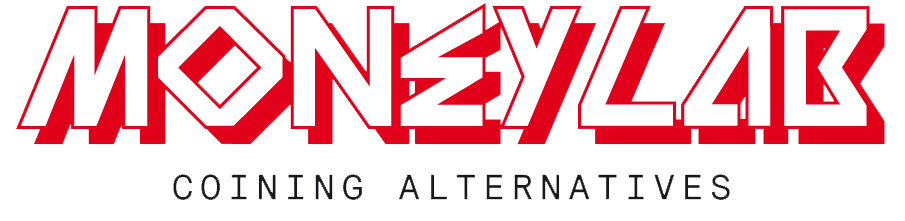

# Project fase 3

!

# Agenda
- recap vorige 2 fases
- showcase
- nieuwe partner
- opdracht
- oplossingsrichting
- verloop fase 3

!

# Showcase!
- [YouTube playlist](http://www.youtube.com/playlist?list=PLcIB_rSU1FQl_gJycl9tv9Ty8I4KcXZyw)
- [Vimeo Album](https://vimeo.com/album/2725582)
- [Ziektecode](http://jorisvanteeffelen.nl/ziektecode/)
- [Ziektecode, teaser kaartjes](https://www.dropbox.com/sh/0jeg9wd41qjjfua/5yQb5SS-S2)

# [Feedback plx >.<](https://github.com/CMDA/Startup/wiki/Feedback)

!

!

!

MoneyLab: Coining Alternatives considers **digital experiments with revenue models, payment systems and currencies** against the backdrop of ongoing global economic decline.

While the economic downturn endures and budget cuts prevail, we have witnessed the emergence and **rise of alternative payment systems and revenue models** in digital media. Online bartering sites, a plethora of crowdfunding platforms, new forms of valuation, e-wallets and crypto-currencies like Bitcoin, are but a few examples. These coincide with the huge growth of mobile money transfer services across Asia and Africa and the general convergence of digital and financial industries.

MoneyLab: Coining Alternatives aims to **critically explore, map and probe the politics, inner-workings and governance of these alternative digital-economic forms**. It is not enough to merely promote and further develop (technical) alternatives, we also need time to ask ourselves critical questions and re-examine the very underpinnings of our endeavors.

(Bron: http://networkcultures.org/wpmu/moneylab/about/)

!

# Hoofdlijn fase 3
Opdracht: Ontwikkel een CMD-beroepsproduct welke de mogelijkheden van alternatieve verdienmodellen toont.

- Iteratie 0 (wk 1/2): concept en pitch
- Iteratie 1 (wk 3/4): ontwikkeling MVP
- Iteratie 2 (wk 5/6): test en herontwerp
- Iteratie 3 (wk 7/8): test en herontwerp

!

# Voorbeelden
- online beheertool voor jouw dogecoin wallet
- stap-voor-stap handleiding om in bitcoin te gaan handelen

- platform voor jonge filmmakers
- karma 4 ever

- ontmarktplaats
- time-sharing voor auto's
- platform voor expertiseuitwisseling

!

# Leerdoelen
- De student kan zich manifesteren in een projectteam; levert een bijdrage aan een goede werksfeer en kan op basis van reflectie en feedback waar nodig eigen handelen bijstellen.
- De student kan op basis van een vraag van een opdrachtgever een actueel en passend concept bedenken en realiseren.
- De student kan een doelgroep identificeren, onderzoeken en inzetten om ontwerpkeuzes te motiveren.
- De student past basiskennis over interactie-, informatie- en visueel ontwerp welke in vakken en projecten is aangeboden toe bij het bedenken en uitwerken van een concept.
- De student kan een prototype testen en op basis van testresultaten herontwerpen.
- De student is in staat op gepaste wijze zowel schriftelijk als mondeling een concept, prototype of product te presenteren.

!

# Beoordeling

!

# En nu?

1. Kies zo snel mogelijk een onderwerp (ook voor M&I!)
2. Bedenk wat je a.s. donderdag van je coach wilt
3. Plan een planning poker en gebruik Trello!

!

# Volgende week
College over pitchen door o.a. Bram Kanstein (Digital Product Development & Startup advice)

